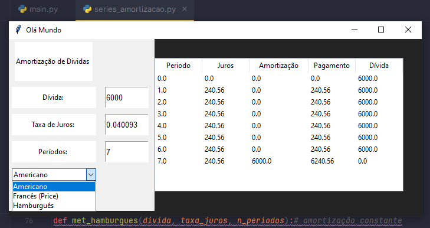

# Sistema de Amortizacao de Dividas
## Sistema de aplicação em python para série de amortização de dívidas
> For studiyng
## Motivação
Atualmente (2° Quadrimestre de 2023) estou cursando pela faculdade a disciplina, Engenharia Econômica, e durante as aulas um dos temas que foram passados foi, 
modelos de Amortização de Dívidas. Com intuito de fixar o conhecimento e aprimorar minhas habildiades de programação fiz esse pequeno projeto que,
recebe o valor da Dívida, taxa de juros dos períodos e o Número de Períodos retornando a tabela repectiva do modelo escolhido.

## Desafio e Etapas
Nessa aplicação o desafio foi desenvolver uma aplicação visual e interativa em Python.

Bibliotecas: 
- NumPy
- Pandas
- Tkinter

O código possui o arquivo main, no qual é formatado o layout da aplicação e, um arquivo auxiliar com as funções para cada respectivo modelo,
mais específico o Americano com juros constantes, Francês (Sistema Price) pagamentos constantes e, Hamburguês amortização constante.

