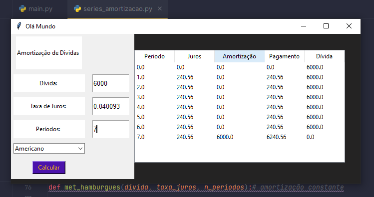

# Sistema de Amortizacao de Dividas
## Sistema de aplicação em python para série de amortização de dívidas
> For studiyng
## Motivação
Atualmente (2° Quarter de 2023) estour cursando pela faculdade Engenharia Econômica e, durante as aulas um dos temas que foram lecionados foram, 
modelos de Amortização de Dívidas. Com intuito de fixar o conhecimento e aprimorar minhas habildiades de programação fiz esse pequeno projeto 
que ao receber o valor da Dívida, taxa de juros dos períodos e o Número de Períodos retorna a tabela repectiva do modelo escolhido.

## Desafio e Etapas
Nessa aplicação o desafio foi desenvolver uma aplicação visual e interativa em Python.
Bibliotecas: 
- NumPy
- Pandas
- Tkinter

